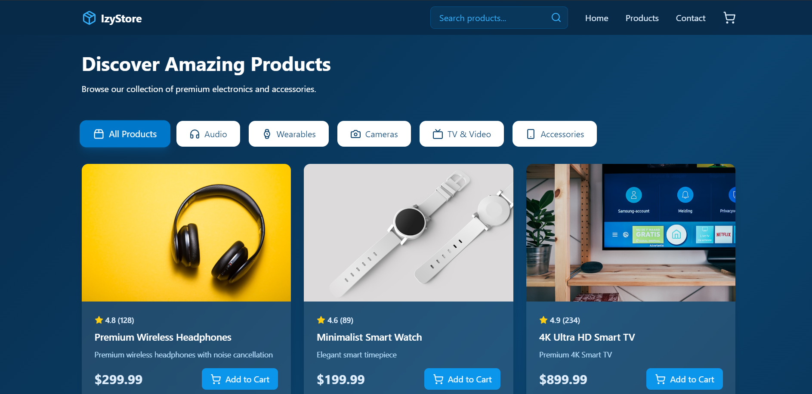

# IzyStore E-commerce Website

A modern e-commerce website built with React, TypeScript, and TailwindCSS.



## Features

- 🛍️ Browse products by category
- 🔍 Search functionality
- 🛒 Shopping cart
- 📱 Responsive design
- ⚡ Fast and modern UI

## Tech Stack

- React 18
- TypeScript
- Vite
- TailwindCSS
- React Router DOM
- Lucide React Icons

## Getting Started

1. Clone the repository:
```bash
git clone https://github.com/Muhammad-izhaan/IzyStore-ecommerce-react.git
```

2. Install dependencies:
```bash
cd IzyStore-ecommerce-react
npm install
```

3. Start the development server:
```bash
npm run dev
```

4. Open [http://localhost:5173](http://localhost:5173) in your browser.

## Connect

- GitHub: [Muhammad-izhaan](https://github.com/Muhammad-izhaan)
- LinkedIn: [Muhammad Izhan](https://www.linkedin.com/in/muhammad-izhan-a404752a6/)

## License

This project is licensed under the MIT License.
